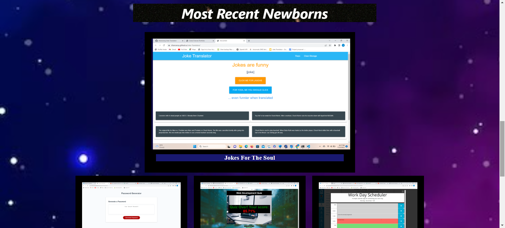

# 02 Advanced CSS 02-Challenge
<!-- On-the-job ticket or feature request Challenges -->

## Description 
The goal is to showcase my skills and talents to employers through a website portfolio. Providing my best completed work in HTML, CSS, and a splash of Javascript as well as my thought processes behind them.

## User Story

AS AN employer
I WANT to view a potential employee's deployed portfolio of work samples
SO THAT I can review samples of their work and assess whether they're a good candidate for an open position

## Acceptance Criteria

GIVEN I need to sample a potential employee's previous work
WHEN I load their portfolio
THEN I am presented with the developer's name, a recent photo or avatar, and links to sections about them, their work, and how to contact them
WHEN I click one of the links in the navigation
THEN the UI scrolls to the corresponding section
WHEN I click on the link to the section about their work
THEN the UI scrolls to a section with titled images of the developer's applications
WHEN I am presented with the developer's first application
THEN that application's image should be larger in size than the others
WHEN I click on the images of the applications
THEN I am taken to that deployed application
WHEN I resize the page or view the site on various screens and devices
THEN I am presented with a responsive layout that adapts to my viewport

## Usage 

This following website is intended to be a personal profolio with a descriptive 'about me' section, links to projects and social media accounts, and a contact form. 

 ## Screenshots

 
 
 

Link: https://sfrancesny.github.io/Portfolio-Website/
